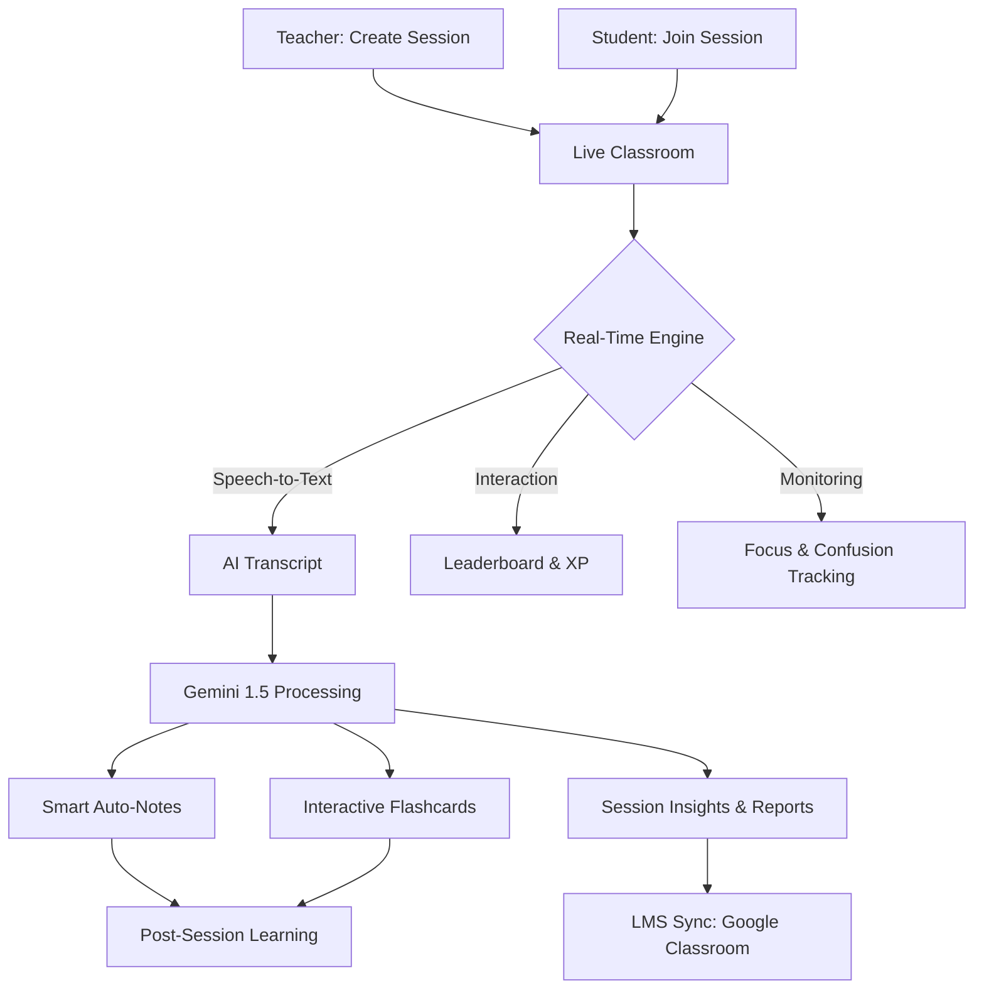

# 🚀 CogniClass AI: The Ultimate AI-Native Classroom Ecosystem


**CogniClass AI** is a revolutionary, real-time classroom intelligence platform designed to bridge the gap between teaching and understanding. Built with Google Gemini 1.5, WebRTC, and MongoDB, it transforms every lecture into a data-driven, gamified learning experience.

---

## 🗺️ Platform Workflow & Architecture

### 🔄 System Flowchart


### 📋 Detailed Workflow Description

#### 1. Session Initiation
The teacher creates a secure, unique classroom room code. Students log in with their **compulsory email and phone credentials** to ensure data persistence across sessions.

#### 2. The Live Intelligence Layer
While the teacher conducts the lecture, **CogniClass AI** actively listens. It performs real-time Speech-to-Text, allowing the **Teacher Copilot** to analyze the session live. If students lose focus or raise their hands silently, the teacher is instantly notified via the dashboard.

#### 3. Gamified Participation
Every correct answer in a **Live Pop Quiz** or successful code execution in the **Code Lab** awards the student points and XP. These are saved to their permanent MongoDB profile, allowing them to unlock badges and climb the global leaderboard.

#### 4. Automated Post-Session Tools
Once the session ends, the teacher triggers the AI processing. Within seconds, the platform generates **Markdown Study Notes** and **3D Flashcards**. These are archived and can be synced directly to external LMS platforms like **Google Classroom**.

---

## 🌟 Key Features

### 🧠 Advanced AI Intelligence
- **Smart Auto-Note Taker**: Instantly generates professional Markdown study notes from live class transcripts.
- **Interactive Flashcards**: Creates 3D-flippable study cards based on lecture content for active recall.
- **Teacher Copilot**: A real-time assistant for teachers that can search historical sessions and provide pedagogical insights.
- **AI Code Reviewer**: Integrated "Senior Developer" AI that provides hints and tips to students in the Code Lab.
- **Voice-to-Quiz**: Generates live pop-quizzes directly from the teacher's spoken words.

### 🎮 Gamification & Engagement
- **Level-Up System**: Real-time XP tracking and leveling for students based on participation.
- **Achievement Badges**: Unlockable badges like "Quick Thinker" and "Problem Solver."
- **Live Leaderboard**: Real-time competitive ranking to keep students motivated.
- **Silent Student Detection**: AI-powered alerts for teachers when students are confused or inactive.

### 🎥 Professional Suite
- **Native Video Recording**: High-quality session recording built directly into the browser.
- **LMS Integration**: One-click sync of attendance and grades to Google Classroom and Canvas.
- **Breakout Rooms**: Intelligent AI-orchestrated groups based on student performance levels.
- **PWA Support**: Install CogniClass AI as a native app on Android, iOS, or Desktop.

---

## 🔐 Security & Authentication

CogniClass AI prioritizes the safety and privacy of the classroom environment:

- **Mandatory Authentication**: Direct "Guest" entry is disabled. All users (Teachers and Students) must have a verified account.
- **Compulsory Student Data**: During registration, students must provide a **Verified Email** and a **Phone Number** to ensure session accountability.
- **JWT Protection**: All API routes and real-time socket connections are protected by **JSON Web Tokens (JWT)**.
- **Bcrypt Hashing**: User passwords are never stored in plain text; they are secured using high-entropy salt and hash algorithms.
- **Hybrid Resilience**: Automatically detects if MongoDB is unavailable and switches to a high-speed **Mock-Database Mode** for zero-configuration local demos.

---

## 💎 Feature Matrix: Teacher vs. Student

| Feature | Teacher | Student |
| :--- | :---: | :---: |
| **Live Recording** | ✅ | ❌ |
| **AI Study Notes Generator** | ✅ | ✅ |
| **Interactive 3D Flashcards** | ✅ | ✅ |
| **Real-time Leaderboard** | ✅ | ✅ |
| **Smart Breakout Rooms** | ✅ | ❌ |
| **AI Code Hint Tool** | ❌ | ✅ |
| **LMS Sync (Google Classroom)** | ✅ | ❌ |
| **Focus Tracking Alerts** | ✅ | ❌ |
| **Anonymous Doubts** | ❌ | ✅ |

---

## ⚖️ Market Comparison: CogniClass AI vs. Others

| Feature | CogniClass AI | Zoom / Google Meet | MS Teams |
| :--- | :---: | :---: | :---: |
| **Real-time AI Notes** | ✅ Native | ❌ | ❌ |
| **AI Study Flashcards** | ✅ Native | ❌ | ❌ |
| **Gamified XP & Badges** | ✅ Native | ❌ | ❌ |
| **Silent Student Detection** | ✅ Native | ❌ | ❌ |
| **Built-in Code Lab** | ✅ Native | ❌ | ❌ |
| **Pedagogical Insights** | ✅ Native | ❌ | ❌ |
| **Recording & Transcription** | ✅ | ✅ (Paid) | ✅ (Paid) |

---

## 🛠️ Tech Stack

- **Frontend**: HTML5, Vanilla CSS3 (Custom Design System), JavaScript (ES6+)
- **Backend**: Node.js, Express.js
- **Database**: MongoDB (Mongoose)
- **Real-Time**: Socket.io, WebRTC
- **AI Engine**: Google Gemini 1.5 Pro/Flash
- **Authentication**: JWT (JSON Web Tokens), Bcrypt.js

---

## 🚀 Getting Started

### Prerequisites
- Node.js (v18+)
- MongoDB (Local or Atlas)
- Google Gemini API Key

### Installation

1. **Clone the repository**
   ```bash
   git clone https://github.com/prachigarg1511/CogniClassAI.git
   cd CogniClassAI
   ```

2. **Install dependencies**
   ```bash
   npm install
   ```

3. **Set up environment variables**
   Create a `.env` file in the root directory:
   ```env
   PORT=3000
   MONGODB_URI=your_mongodb_connection_string
   JWT_SECRET=your_secret_key
   GEMINI_API_KEY=your_google_ai_key
   ```

4. **Run the application**
   ```bash
   npm run server
   ```

---

## 👥 Contributors

| Profile | Name | Description |
| :--- | :--- | :--- |
|  | **Prachi Garg** | **Lead Architect & Full-Stack Developer**. Passionate about bridging the gap between Artificial Intelligence and Education. Built the core AI engine, gamification logic, and real-time synchronization for CogniClass AI. |

---

## 🛣️ Roadmap
- [ ] **AI Video Analytics**: Real-time emotion detection for audience sentiment.
- [ ] **Automated Parent Reports**: Weekly AI-generated emails to parents on student progress.
- [ ] **Virtual AR Whiteboard**: Collaborative 3D drawing space for complex concepts.

---

## 📜 License
This project is licensed under the MIT License - see the [LICENSE](LICENSE) file for details.

---

### Made with ❤️ by Prachi Garg
